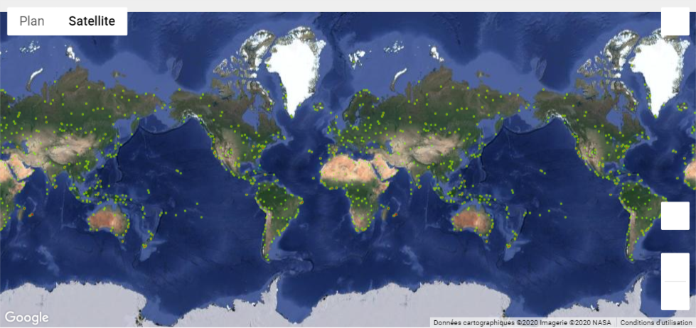
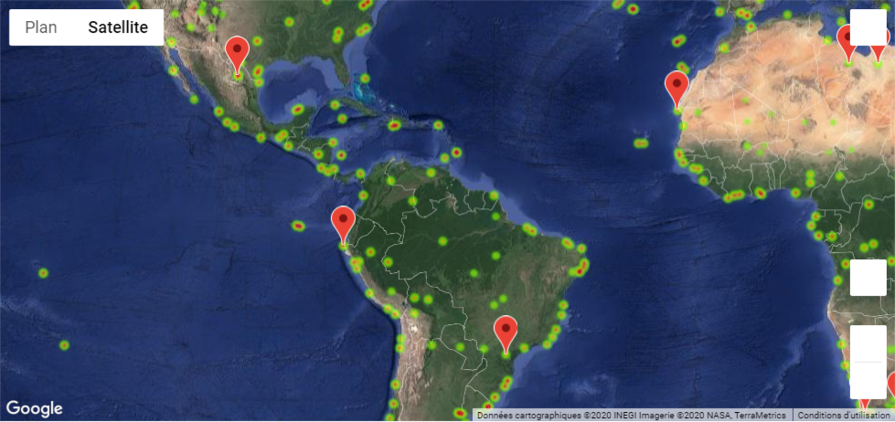

# Random Weather Locator

## By Erick Hernandez

API for Cities and Weather project 

In this project, I was able to demonstrate how to extract information from certain websites and shape it in order to conduct an analysis of its composition.

### WeatherPy

First, I needed to download a random set of cities coordinates and identify their country and geographical location. With the help of Pandas DataFrames, I could generate random coordinates, look for the nearest city using Cities module and performing a custom API call with OpenWeather servers.

Several fields were required for the climate analysis, such as cloudiness, humidity, latitude and longitude, wind speed and maximal temperature. After getting the response from OpenWeather API call, I had to identify the proper datum for each row. Later I had to clean my DataFrame and store it into a CSV.

As an additional task, I generated a linear regression taking into account the latitude and weather fields (temperature, wind speed, humidity)

I found out it was easier to perform such task by identifying both hemispheres (North and South). In these plots, I added the linear regression equation as an informative value. It was notorious that the further the city is located from the Equator, the colder and humider it gets.

### VacationPy

After that, a function localizing hotels in selected cities with specific weather conditions was made, creating markers placed on top of a Google Map.

The location of the cities themselves was made with a heatmap.

For the selection of the hotels, I selected cities with a temperature between 80°F and 70°F (27°C and 21°C), 0% cloudiness and a maximal speed of 10mph (16kph).

The marker was placed on top of each selected hotel.

---